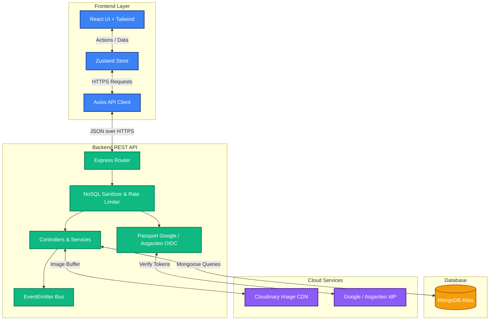
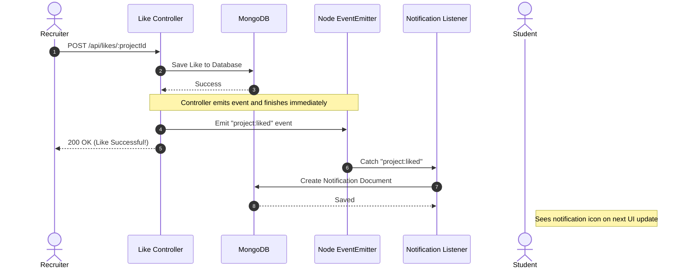

# 🎨 DevCanvas


**DevCanvas** is a premium, modern platform designed to bridge the gap between talented university students and tech recruiters. Students can build sleek portfolios to showcase their projects, while recruiters can easily search, discover, and connect with fresh talent.

---

## ✨ Features

- **Multi-Provider Authentication:** Supports both **Google OAuth 2.0** and **Asgardeo OIDC** for secure, password-less authentication.
- **Role-Based Access Control (RBAC):** Distinct permissions for `STUDENTS` (upload portfolios), `RECRUITERS` (search, follow, like), and `ADMINS` (system moderation, user management, project deletion).
- **Project Portfolios:** Students can upload projects with cover images, screenshot galleries, GitHub/Demo links, stall/bookfair details, and technology tags.
- **Advanced Real-Time Search:** Client-side dynamic search to instantly filter projects by tags, title, or student name.
- **Cloudinary Integration:** Robust image uploading system backed by Multer with 5MB memory constraints.
- **Event-Driven Notifications:** Real-time background event listeners generate notifications when projects are liked.
- **OWASP Top 10 Hardened:** Enterprise-grade security including rate limiting, NoSQL injection protection, HS256 JWT validation, and strict CORS.
- **End-to-End HTTPS:** Native SSL support using `mkcert` locally for backend and frontend dev servers.
- **Premium UI:** Built with Tailwind CSS featuring backdrop blurs, glassmorphism, responsive grids, and micro-animations.

---

## 🛡️ OWASP Top 10 Security Architecture

DevCanvas has undergone comprehensive security audit and defensive hardening:

| Category | Defensive Measures Applied |
|---|---|
| **A01: Broken Access Control** | Role-based authorization middleware (`roleMiddleware`), Admin bypass for project management, server-side ownership checks, and IDOR protection on notifications. |
| **A02: Cryptographic Failures** | Strict JWT algorithm enforcement (`HS256`), secure session cookie attributes (`httpOnly`, `sameSite: 'lax'`, `secure`), and environment secret isolation. |
| **A03: Injection** | Custom Express 5 NoSQL injection middleware stripping `$` and `.` operators from request bodies; parameterized Mongoose queries. |
| **A04: Insecure Design** | IP-based rate limiting on authentication routes (50 req/15min) and global API endpoints (500 req/15min). |
| **A05: Security Misconfiguration** | Helmet security HTTP headers, strict CORS origin validation, body payload limits (1MB), and production error handling stripping stack traces. |
| **A06: Vulnerable Components** | `npm audit` integrated into CI workflow; updated packages to patch vulnerabilities (e.g. React Router CSRF fix). |
| **A07: Identification & Auth** | OIDC/OAuth 2.0 delegation, brute-force rate-limiting, and explicit JWT verification rules. |
| **A09: Logging & Monitoring** | Audit logging for authentication success, account lockouts, unauthorized access attempts, and Morgan HTTP request logging. |

---

## 🏗️ System Architecture

DevCanvas utilizes a decoupled, Monorepo architecture separating the Vite-powered React frontend from the Node/Express backend.



---

## 🔔 Event-Driven Notification System

To ensure a fast, non-blocking user experience, DevCanvas utilizes an asynchronous event-driven architecture for social interactions (like notifications).



---

## 🚀 Tech Stack

### Frontend
- **Framework:** React 18 powered by Vite
- **Styling:** Tailwind CSS
- **State Management:** Zustand
- **Routing:** React Router v7
- **HTTP Client:** Axios (HTTPS-configured)
- **Notifications:** React Toastify
- **Icons:** Lucide React

### Backend
- **Runtime:** Node.js
- **Framework:** Express.js 5
- **Database:** MongoDB & Mongoose
- **Authentication:** Passport.js (Google OAuth 2.0 & Asgardeo OIDC) + JWT (`HS256`)
- **Security:** Helmet, CORS, Custom NoSQL Sanitizer, Express-Rate-Limit
- **File Upload:** Multer & Cloudinary

---

## 🛠️ Local Development Setup

### Prerequisites
- Node.js (v18+)
- MongoDB connection string (Local or Atlas)
- Cloudinary Account (for image uploads)
- Google Cloud Console & Asgardeo Developer Console (for OAuth/OIDC credentials)
- `mkcert` (optional, for local HTTPS cert generation)

### 1. Clone & Install
```bash
git clone https://github.com/ThisariHewage/dev-canvas.git
cd dev-canvas

# Install backend dependencies
cd backend
npm install

# Install frontend dependencies
cd ../frontend
npm install
```

### 2. Environment Variables

Create a `.env` file in the **backend** directory:
```env
PORT=3000
MONGODB_URI=your_mongodb_uri
CLIENT_URL=http://localhost:5173
JWT_SECRET=your_super_secret_key
NODE_ENV=development

# Google OAuth
GOOGLE_CLIENT_ID=your_google_client_id
GOOGLE_CLIENT_SECRET=your_google_client_secret
GOOGLE_CALLBACK_URL=http://localhost:3000/api/auth/google/callback

# Asgardeo OIDC
ASGARDEO_CLIENT_ID=your_asgardeo_client_id
ASGARDEO_CLIENT_SECRET=your_asgardeo_client_secret
ASGARDEO_ORGANIZATION=your_org

# Cloudinary
CLOUDINARY_CLOUD_NAME=your_cloud_name
CLOUDINARY_API_KEY=your_api_key
CLOUDINARY_API_SECRET=your_api_secret
```

Create a `.env` file in the **frontend** directory:
```env
VITE_API_URL=http://localhost:3000/api
```

### 3. Run the Application
Run both servers simultaneously in separate terminals:

**Terminal 1 (Backend):**
```bash
cd backend
npm run dev
```

**Terminal 2 (Frontend):**
```bash
cd frontend
npm run dev
```

The app will be running securely at `http://localhost:5173`.

---

## 📁 API Structure

| Endpoint | Method | Access | Description |
|----------|--------|--------|-------------|
| `/api/auth/google` | GET | Public | Initiate Google OAuth Login |
| `/api/auth/asgardeo` | GET | Public | Initiate Asgardeo OIDC Login |
| `/api/auth/me` | GET | Authenticated | Get currently authenticated user details |
| `/api/projects` | GET | Public | Fetch all published projects |
| `/api/projects` | POST | Student | Create a new project submission |
| `/api/projects/:id` | PUT | Owner / Admin | Update project details |
| `/api/projects/:id` | DELETE | Owner / Admin | Delete a project |
| `/api/likes/:projectId`| POST | Recruiter | Toggle a project like |
| `/api/follows/:userId`| POST | Recruiter | Toggle following a student |
| `/api/notifications`| GET | Authenticated | Fetch user unread notifications |
| `/api/admin/users` | GET / PUT / DELETE | Admin | Admin user management |
| `/api/admin/projects` | GET | Admin | System moderation project view |

---

## 👥 Contributors
Developed as part of the SE/2022 batch practical assignment.  
*Architected and led by the core DevCanvas Team.*

